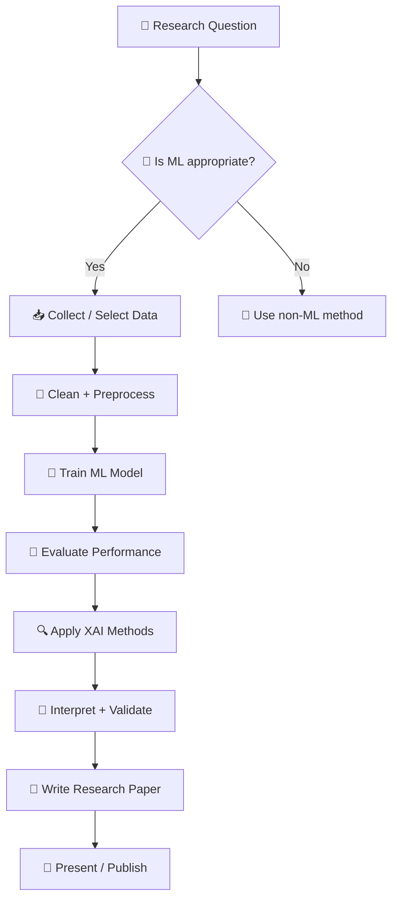
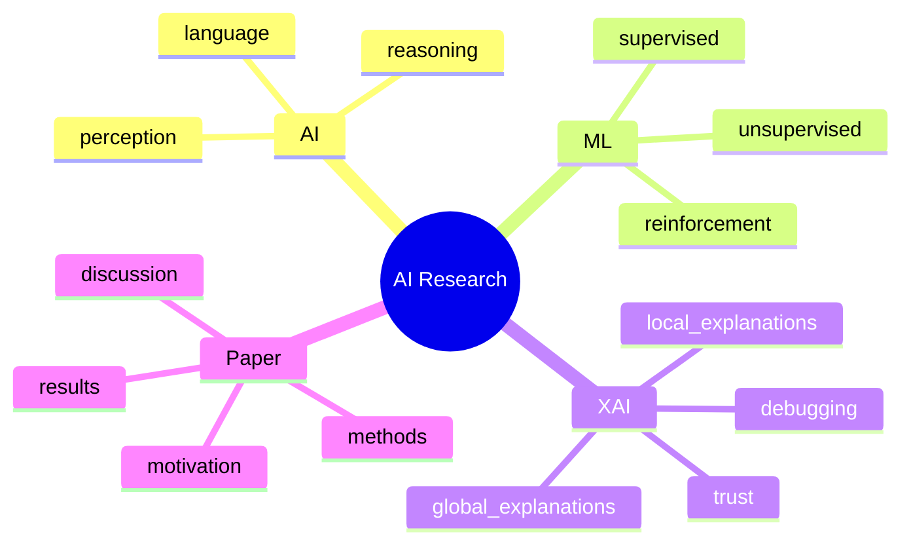

<!-- =========================================================
Module 01: Introduction (README.md)
Paste this entire content into: modules/01-introduction/README.md
========================================================= -->


# Module 01: Introduction to Artificial Intelligence, Machine Learning, and Explainable AI

   

**Goal:** Understand **AI → ML → XAI** and how they connect to writing a strong **research paper/thesis**.

## 🔎 Quick Navigation

<!-- ✅ FIXED (Roadmap bug solved) -->
<!-- Reason: GitHub auto-anchor sometimes breaks with emoji/colon headings.
     Solution: Use stable custom anchors via <a id="..."></a> and link to them. -->

<p align="center">
  <a href="#overview"></a>
  <a href="#prerequisites"></a>
  <a href="#objectives"></a>
  <a href="#roadmap"></a>
</p>

<p align="center">
  <a href="#use-repo"></a>
  <a href="#workflow"></a>
  <a href="#content"></a>
  <a href="#takeaways"></a>
</p>

<p align="center">
  <a href="#exercise"></a>
  <a href="#glossary"></a>
  <a href="#resources"></a>
  <a href="#self-check"></a>
</p>

<p align="center">
 <a href="#discussion"></a>
 <a href="#need-help"></a>
 <a href="#whats-next"></a>
</p>

---


<a id="overview"></a>
## 🧭 Overview

Welcome to the beginning of your AI research journey! This module introduces:

* 🤖 **Artificial Intelligence (AI):** machines doing tasks that usually require human intelligence
* 📈 **Machine Learning (ML):** AI systems that **learn from data** instead of fixed rules
* 🔍 **Explainable AI (XAI):** methods that make model decisions **understandable, verifiable, and publishable**

> [!IMPORTANT]
> In research, **accuracy alone isn’t enough**. You should also explain *why* a model behaves as it does—especially for scientific claims and high-stakes domains.

### ✨ At a Glance (fast summary)

| Concept | What it means                    | Why researchers care           |
| ------- | -------------------------------- | ------------------------------ |
| **AI**  | Intelligent behavior in machines | Automation, decision support   |
| **ML**  | Learning patterns from data      | Prediction, discovery          |
| **XAI** | Explaining ML decisions          | Trust, insight, publishability |

**⏱ Duration:** 2–3 hours
**🎯 Difficulty:** Beginner → Intermediate

---
<a id="prerequisites"></a>
## ✅ Prerequisites

None! This is where everyone starts.

You only need:

* 🔍 Curiosity about AI and its applications
* 💻 Basic computer skills
* ✨ Willingness to learn

---
<a id="objectives"></a>
## 🎯Objectives

By the end of this module, you will be able to:

| You will learn to… ✅                           | So you can… 🧩                         |
| ---------------------------------------------- | -------------------------------------- |
| Define **AI**, **ML**, **XAI** in simple terms | Write a clear background section       |
| Explain **why XAI matters**                    | Justify your methods and improve trust |
| Identify good **ML research use-cases**        | Form strong research questions         |
| Map the end-to-end workflow                    | Plan a clean thesis/paper structure    |

---

<!-- ✅ Put these anchors right BEFORE the corresponding headings in your file -->

<a id="roadmap"></a>
## 🗺️ Roadmap: Where This Module Fits

This repository is organized like a **research pipeline**. Each module supports a part of your paper.

| Repo Module                      | Research workflow step              | Paper section it supports |
| -------------------------------- | ----------------------------------- | ------------------------- |
| **01** Introduction              | Concepts + big picture              | Introduction / Motivation |
| 02 Problem formulation           | Research question + success metrics | Problem statement         |
| 03 Data selection & acquisition  | Data sources + ethics               | Data & Materials          |
| 04 Data handling & preprocessing | Cleaning + features                 | Methods                   |
| 05 Model development             | Training + tuning                   | Methods                   |
| 06 Explainable AI (XAI)          | Explanations + interpretation       | Methods / Results         |
| 07 Evaluation & interpretation   | Metrics + validation                | Results / Discussion      |
| 08 Deployment                    | Optional real-world use             | Appendix / System         |
| 09 Paper writing                 | Packaging the story                 | Full paper                |

---
<a id="use-repo"></a>
## 🧰 How to Use This Repo

### ✅ Recommended learning path

1. Read each module `README.md` in order
2. Run notebooks in `examples/` (if present)
3. Complete the hands-on exercises
4. Keep a running “paper draft” in your notes

### 🚀 Quick start (Git)

```bash
git clone <YOUR_REPO_URL>
cd XAI_TR
cd modules/01-introduction
```


### 🗂️ Typical structure

| Folder       | What it contains               |
| ------------ | ------------------------------ |
| `modules/`   | Step-by-step modules (01 → 09) |
| `examples/`  | Notebooks/scripts to run       |
| `resources/` | Links + reading                |
| `visuals/`   | Diagrams/figures               |

> [!TIP]
> Treat each module as a **paper-building block**. By Module 09, you’ll have most sections drafted.

---
<a id="workflow"></a>
## 🔁 Workflow Overview (ML → XAI → Paper Writing)

**Figure 1 — Research-to-Paper Workflow (ML + XAI):**



**Figure 2 — Concept Map (AI → ML → XAI → Paper):**



<hr/>
<a id="content"></a>
## 📚 Module Content

### Section 1: What is Artificial Intelligence (AI)?

**Simple Definition:**
AI is the ability of machines to perform tasks that typically require human intelligence—like recognizing patterns, making decisions, understanding language, or solving problems.

**Think of it This Way:**
Teaching a child to recognize animals: show examples → learn patterns → recognize new cases. AI aims for similar “learning and reasoning” behavior in machines.

**Real-World Examples:**

* 📩 **Spam filters:** detect unwanted messages
* 🎙️ **Voice assistants:** understand and respond to language
* 🎬 **Recommendation systems:** suggest what you may like
* 🏥 **Medical support:** help identify patterns in images and signals

**Why Researchers Should Care: AI can help you:**

* ⚡ Analyze large datasets faster
* 🧩 Discover hidden relationships in data
* 🔮 Predict outcomes and trends
* 🔁 Automate repetitive steps
* 🔬 Improve reproducibility

---

### Section 2: What is Machine Learning (ML)?

**Simple Definition:**
ML is a subset of AI where computers learn patterns from data rather than being explicitly programmed with rules for every scenario.

**The Analogy:**
Learning to ride a bike: you try → wobble → adjust → improve. ML learns by exposure to examples and feedback.

#### 🔎 AI vs ML vs Deep Learning vs XAI (quick clarity)

| Term                   | What it is                       | What it’s NOT                |
| ---------------------- | -------------------------------- | ---------------------------- |
| **AI**                 | Broad goal: intelligent behavior | A single algorithm           |
| **ML**                 | Learning from data               | Only neural networks         |
| **Deep Learning (DL)** | ML using multi-layer neural nets | Always better than ML        |
| **XAI**                | Explaining model behavior        | A replacement for evaluation |

#### Types of Machine Learning

**Figure 3 — ML types and what you need:**

| Type             | What you provide  | What the model learns | Example                |
| ---------------- | ----------------- | --------------------- | ---------------------- |
| ✅ Supervised     | Data + labels     | Predict labels        | Disease vs healthy     |
| 🔎 Unsupervised  | Data only         | Groups/structure      | Patient clustering     |
| 🎮 Reinforcement | Rewards/penalties | Best actions          | Robot learning to walk |

**Key Concept: Training vs. Using**

* 🏋️ **Training:** learning patterns from example data (like studying)
* 🧪 **Inference/Prediction:** applying learned patterns to new data (like an exam)

**Research Applications by Field:**

| Research Field        | ML Application Example                                |
| --------------------- | ----------------------------------------------------- |
| Biology               | Predicting protein structures, classifying cell types |
| Medicine              | Diagnosing diseases, predicting patient outcomes      |
| Environmental Science | Forecasting climate patterns, monitoring wildlife     |
| Social Sciences       | Analyzing networks, predicting behaviors              |
| Engineering           | Optimizing designs, predicting system failures        |
| Agriculture           | Crop yield prediction, pest detection                 |

---

### Section 3: What is Explainable AI (XAI)?

**The Problem:**
Many ML models can be **high-performing** but hard to interpret (“black boxes”). In research, unclear reasoning weakens trust, limits insight, and can reduce publication quality.

**Simple Definition:**
XAI methods make AI decisions understandable. They answer: **“Why did the model predict this?”**

#### Without XAI vs With XAI (mini-scenario)

| Scenario      | What you get                               | Risk                            |
| ------------- | ------------------------------------------ | ------------------------------- |
| ❌ Without XAI | “Prediction: cancer (95%)”                 | Hard to verify or trust         |
| ✅ With XAI    | “Focused on irregular borders + asymmetry” | Supports validation and insight |

#### Why XAI is Critical for Research

1. ✅ **Trust and verification** — ensure decisions are for the right reasons
2. 🔬 **Scientific discovery** — reveal meaningful drivers in your data
3. 🛠️ **Debugging and improvement** — detect failure modes and spurious correlations
4. ⚖️ **Ethical responsibility** — identify bias and unsafe behavior
5. 📄 **Publication quality** — supports transparent methodology and discussion

#### Types of Explanations

| Type          | Question answered                    | Example                                |
| ------------- | ------------------------------------ | -------------------------------------- |
| 🌍 **Global** | “How does the model behave overall?” | “Age & cholesterol matter most.”       |
| 📍 **Local**  | “Why this prediction for this case?” | “High BP + family history drove risk.” |

---

### Section 4: The AI Research Workflow

**Figure 4 — End-to-end workflow (text version):**

```text
Research Question
  ↓
Is ML Appropriate?
  ↓
Collect / Select Data
  ↓
Clean + Preprocess
  ↓
Train ML Model
  ↓
Evaluate Performance
  ↓
Apply XAI
  ↓
Interpret + Validate
  ↓
Write & Publish
```

> [!NOTE]
> XAI is most powerful when paired with evaluation. Explanations should complement metrics—not replace them.

---

### Section 5: Real-World Research Success Stories

* 🧬 **Drug discovery:** predict promising compounds faster
* 🌦️ **Climate prediction:** improve forecasts; identify key climate variables
* 🛰️ **Archaeology:** detect patterns in satellite imagery; validate signals with XAI
* 🏥 **Patient risk prediction:** predict complications and explain risk factors

✅ **Pattern:** ML produces predictions, and XAI turns them into **defensible scientific insight**.

---

### Section 6: Common Myths About AI/ML

* ❌ “You must be a programmer to use AI.” → ✅ Many tools are beginner-friendly
* ❌ “AI solves research automatically.” → ✅ You still need domain expertise + logic
* ❌ “Only huge datasets work.” → ✅ Many methods succeed with modest data
* ❌ “Black box is always better.” → ✅ Interpretable models can be competitive
* ❌ “AI replaces researchers.” → ✅ AI supports researchers; humans drive meaning

---

### Section 7: How to Use This Course

**Course Philosophy:**

* 🧪 Learn by doing
* 🧱 Start simple, build gradually
* 🧠 Focus on understanding
* 📄 Research-first mindset

**What You’ll Need:**

* 💻 Computer + internet
* 🐍 Python (covered later)
* ⏳ 5–10 hours/week
* ✨ Curiosity + patience

**Learning Tips Checklist ✅**

* [ ] Work through modules in order
* [ ] Try at least one example notebook per module
* [ ] Write 3–5 bullet “paper notes” after each module
* [ ] Ask questions in GitHub Discussions
* [ ] Open issues when you find improvements

<hr/>
<a id="takeaways"></a>
## 💡 Key Takeaways

* 🤖 **AI** = intelligent behavior in machines
* 📈 **ML** = learning from data to predict/discover patterns
* 🔍 **XAI** = explaining model decisions for trust and insight
* 🧭 This repo guides you from question → model → explanation → paper
* ✅ Beginners can start now and build step-by-step

---
<a id="exercise"></a>
## 🧪 Hands-On Exercise

### Exercise 1: Identifying AI Opportunities in Your Research

**Objective:** Reflect on how AI/ML could apply to your research area.

**Your Task:**

1. **Describe your research area** (2–3 sentences)

   * What field do you work in?
   * What questions do you investigate?
2. **Identify your data**

   * What kind of data do you collect/use?
   * How much data do you typically have?
   * Is it labeled or unlabeled?
3. **Brainstorm ML applications**

   * Classify/categorize? Predict outcomes? Find hidden patterns? Automate analysis?
4. **Explainability needs**

   * Why does understanding the model’s reasoning matter in your field?
   * What would you want the AI to explain?

<details>
  <summary><b>📌 Example Response (click to expand)</b></summary>

* **Research Area:** I study plant disease in agriculture and investigate environmental conditions that lead to infections.
* **Data:** Plant images (hundreds/season) + temperature/humidity/soil data. Images labeled as healthy/diseased.
* **ML Applications:** Detect disease from images; predict outbreaks using environment; rank most important factors.
* **Explainability Needs:** I need to know which visual cues and environmental features drive predictions to guide prevention.

</details>

---
<a id="glossary"></a>
## 📖 Glossary

| Term          | Meaning                                                      |
| ------------- | ------------------------------------------------------------ |
| **AI**        | Systems that perform tasks requiring human-like intelligence |
| **ML**        | AI that learns patterns from data                            |
| **XAI**       | Methods that make model decisions understandable             |
| **Training**  | Teaching a model using example data                          |
| **Inference** | Using a trained model on new data                            |
| **Black box** | A model whose reasoning isn’t transparent                    |

---
<a id="resources"></a>
## 📚 Resources and Further Reading

> [!TIP]
> Place stable links in `resources/README.md` so modules stay clean and consistent.

* 📘 Essential Reading (non-technical AI + why explainability matters)
* 🎥 Video Tutorials (intro ML + neural nets visually)
* 🧩 Interactive Tools (Teachable Machine, TF Playground)
* 📚 Beginner-friendly books (Mitchell, Domingos)

---
<a id="self-check"></a>
## 🧠 Self-Check Questions

1. What’s the difference between AI and ML?

<details><summary><b>Show Answer</b></summary>
AI is the broader goal of intelligent behavior; ML is a way to achieve AI by learning patterns from data.
</details>

2. Why is XAI important for research?

<details><summary><b>Show Answer</b></summary>
It improves trust, supports scientific insight, helps debugging, and strengthens publishability through transparency.
</details>

3. Name two types of ML.

<details><summary><b>Show Answer</b></summary>
Supervised learning and unsupervised learning (also reinforcement learning).
</details>

4. Do you need to be a programmer to use AI in research?

<details><summary><b>Show Answer</b></summary>
Not necessarily. Many tools are user-friendly, but basic coding helps you control experiments and write reproducible research.
</details>

---
<a id="discussion"></a>
## 💬 Discussion Questions

1. In your field, what are the benefits and risks of using AI without explainability?
2. When is understanding **why** a model predicted something more important than the prediction itself?
3. What concerns do you have about AI in your research, and how might this repo help?

---

<!-- =========================
✅ FIXED ANCHORS for: Need Help + What's Next
Step 1: Put these anchors JUST ABOVE the headings
========================= -->

<a id="need-help"></a>
## 🆘 Need Help?

* 💬 Concept questions → open a GitHub Discussion
* 🐛 Found an issue → open a GitHub Issue

**Last Updated:** January 2026

---

<a id="whats-next"></a>
## ⏭️ What’s Next?

You’ve completed **Module 01** 🎉  
Next: **Module 02 — Research Problem Formulation**

**Before moving on:**
- [ ] Review key takeaways
- [ ] Complete the hands-on exercise
- [ ] Try the self-check questions

---


